# Manual de Usuario - PetCare

## Guía Completa para Usuarios

Bienvenido a PetCare. Este manual te explica cómo usar la app para cuidar mejor a tus mascotas. Si es tu primera vez aquí, no te preocupes, te guiamos paso a paso.

---

## Tabla de Contenidos

### Manual de Usuario
1. [Introducción](#1-introducción)
2. [Acceso a la Aplicación](#2-acceso-a-la-aplicación)
3. [Crear una Cuenta](#3-crear-una-cuenta)
4. [Iniciar Sesión](#4-iniciar-sesión)
5. [El Dashboard Principal](#5-el-dashboard-principal)
6. [Agregar tu Primera Mascota](#6-agregar-tu-primera-mascota)
7. [Editar Información de una Mascota](#7-editar-información-de-una-mascota)
8. [Analizar Salud con Inteligencia Artificial](#8-analizar-salud-con-inteligencia-artificial)
9. [Crear Recordatorios](#9-crear-recordatorios)
10. [Ver el Calendario de Eventos](#10-ver-el-calendario-de-eventos)
11. [Subir Documentos Veterinarios](#11-subir-documentos-veterinarios)
12. [Usar el Asistente Virtual](#12-usar-el-asistente-virtual)
13. [Seguimiento de Peso, Vacunas y Desparasitaciones](#13-seguimiento-de-peso-vacunas-y-desparasitaciones)
14. [Actualizar Foto de Perfil de Mascota](#14-actualizar-foto-de-perfil-de-mascota)
15. [Cambiar Idioma y Tema](#15-cambiar-idioma-y-tema)

### Información Técnica para Desarrolladores
17. [Arquitectura del Sistema](#17-arquitectura-del-sistema)
18. [Tecnologías Utilizadas](#18-tecnologías-utilizadas)
19. [Instalación y Configuración](#19-instalación-y-configuración)
20. [Estructura del Proyecto](#20-estructura-del-proyecto)
21. [Configuración de Variables de Entorno](#21-configuración-de-variables-de-entorno)
22. [Servicios y APIs](#22-servicios-y-apis)
23. [Base de Datos y Backend](#23-base-de-datos-y-backend)
24. [Despliegue](#24-despliegue)
25. [Contribuir al Proyecto](#25-contribuir-al-proyecto)

---

## 1. Introducción

### ¿Qué es PetCare?

Es una app web para cuidar la salud de tus mascotas. Básicamente puedes:

- Llevar el registro de todas tus mascotas
- Analizar fotos de su piel con inteligencia artificial
- Crear recordatorios para vacunas y citas
- Guardar documentos del veterinario
- Preguntarle cosas a un asistente virtual
- Llevar el control de peso, vacunas y desparasitaciones

### ¿Qué necesitas?

Solo un navegador moderno (Chrome, Firefox, Safari o Edge), internet y un correo electrónico. Eso es todo.

---

## 2. Acceso a la Aplicación

Abre la app en tu navegador. Verás la página de inicio con el botón "Comenzar". Haz clic ahí para registrarte o iniciar sesión.

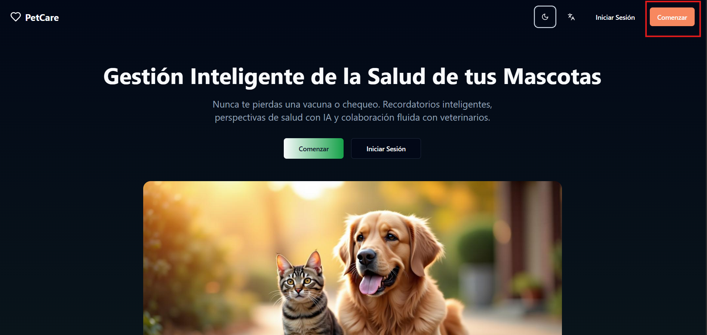
---

## 3. Crear una Cuenta

Haz clic en "Comenzar" o "Registrarse". Llena el formulario con tu nombre, correo y contraseña (mínimo 6 caracteres). El teléfono es opcional. Acepta los términos si aparece y listo. Si te piden verificar el correo, revisa tu bandeja de entrada.

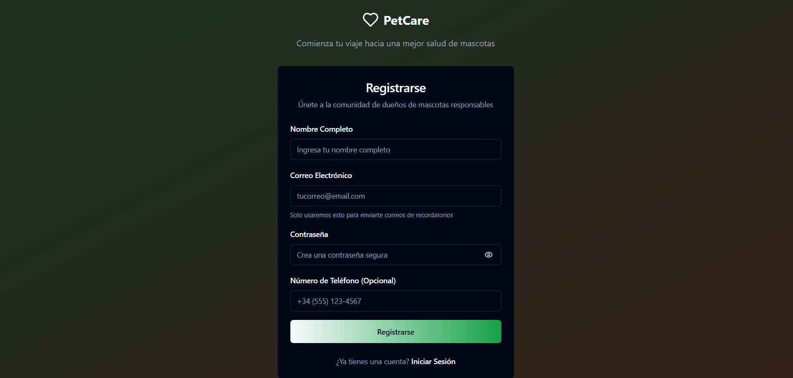
---

## 4. Iniciar Sesión

Pon tu correo y contraseña. Si quieres que te recuerde, marca "Recuérdame". Si olvidaste tu contraseña, usa el enlace de recuperación.

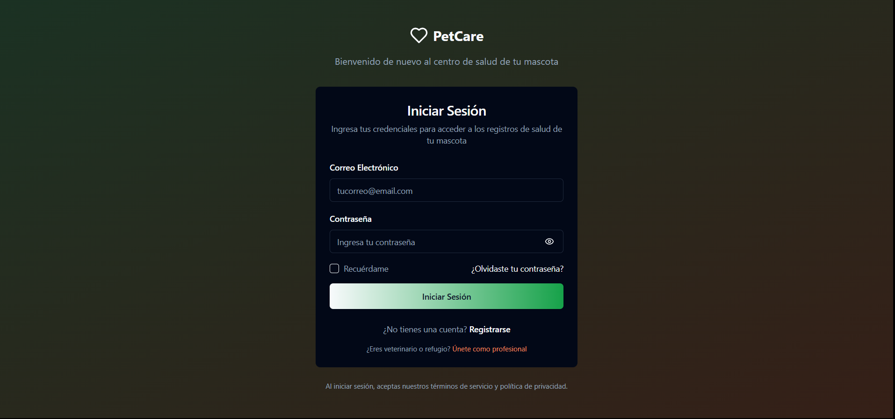
---

## 5. El Dashboard Principal

Esta es tu pantalla principal. Aquí verás:

- Arriba: el menú, opciones de idioma/tema y tu perfil
- Un saludo con tu nombre
- Las tarjetas de tus mascotas (con sus fotos si las subiste)
- Botones rápidos para las funciones más usadas
- Tus recordatorios próximos
- Análisis recientes y documentos del veterinario

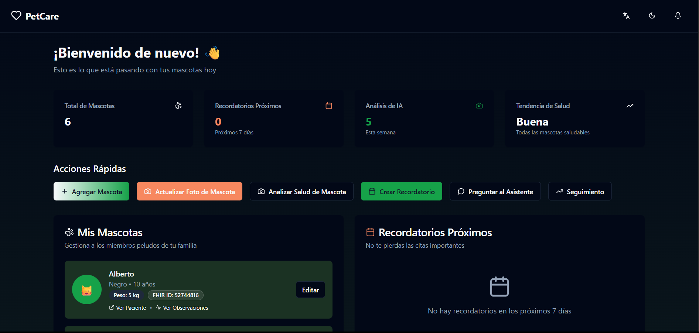
---

## 6. Agregar tu Primera Mascota

Haz clic en "Agregar Mascota". Solo necesitas poner el nombre y la especie (Perro, Gato u Otro). Lo demás es opcional: raza, fecha de nacimiento o edad, peso actual y última vacuna. Si quieres, sube una foto (JPG, PNG o GIF). Guarda y listo.

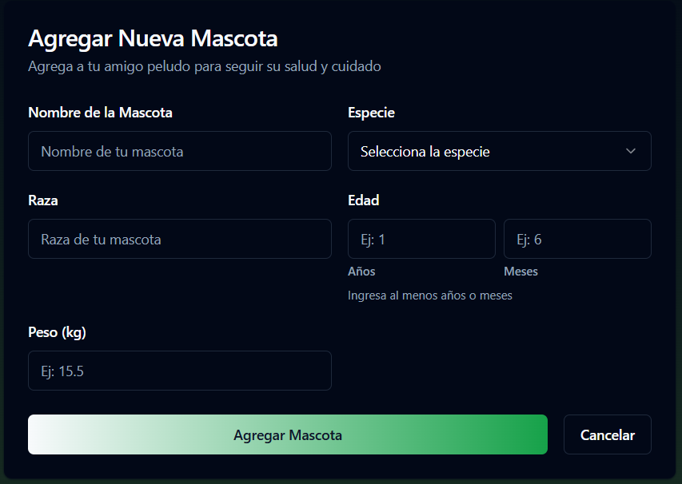
---

## 7. Editar Información de una Mascota

En la tarjeta de tu mascota, haz clic en "Editar" (o el ícono de lápiz). Cambia lo que necesites y guarda. Si quieres eliminar una mascota, usa el botón correspondiente, pero cuidado: se borrarán todos sus datos.


---

## 8. Analizar Salud con Inteligencia Artificial

Haz clic en "Analizar Salud de Mascota", elige tu mascota y si es perro o gato. Sube una foto de la piel (arrastra o selecciona el archivo). El análisis tarda unos segundos y te muestra qué puede ser, qué tan seguro está el sistema, recomendaciones y la severidad.

**Ojo**: Esto es solo informativo. Para un diagnóstico real, ve al veterinario.

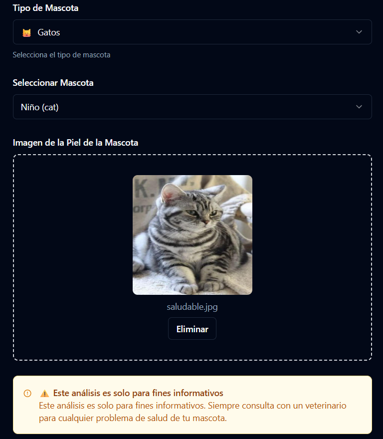
---

## 9. Crear Recordatorios

Haz clic en "Crear Recordatorio". Ponle un título (como "Vacunación Anual"), la fecha y el tipo. Si quieres, agrega una hora, descripción o asócialo a una mascota. Guarda y aparecerá en tu calendario.

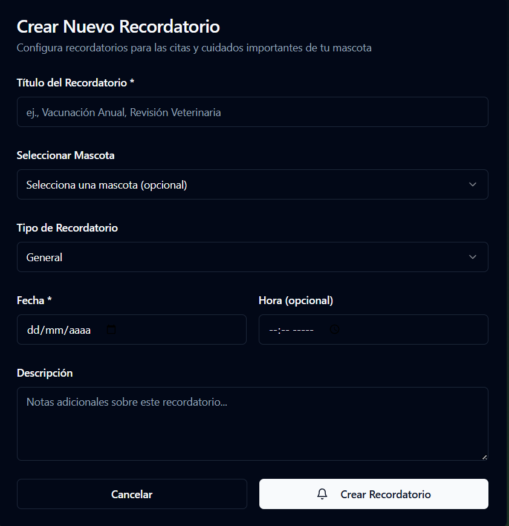
---

## 10. Ver el Calendario de Eventos

Abre el calendario desde el Dashboard. Los días con recordatorios aparecen marcados. Haz clic en cualquier día para ver qué tienes programado. Abajo verás los próximos 7 días. Cuando completes algo, márcalo como hecho.

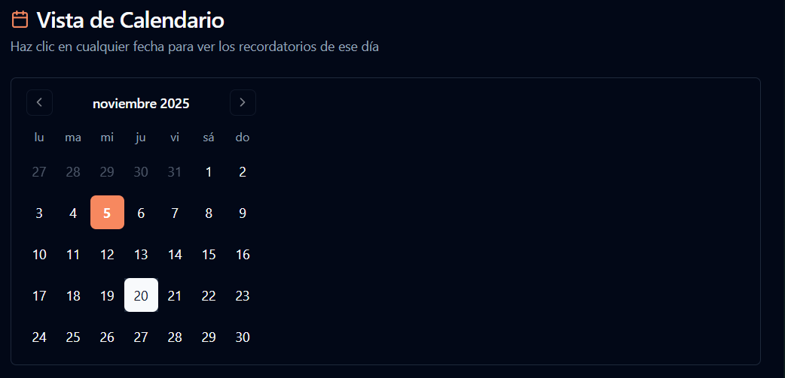
---

## 11. Subir Documentos Veterinarios

Haz clic en "Subir Nota del Veterinario". Ponle un título, elige la mascota y sube el PDF (máximo 10MB). Si quieres, completa el nombre del veterinario, la fecha y una descripción. También puedes usar "Rellenar con IA" para que la app genere la descripción automáticamente. Guarda y listo.

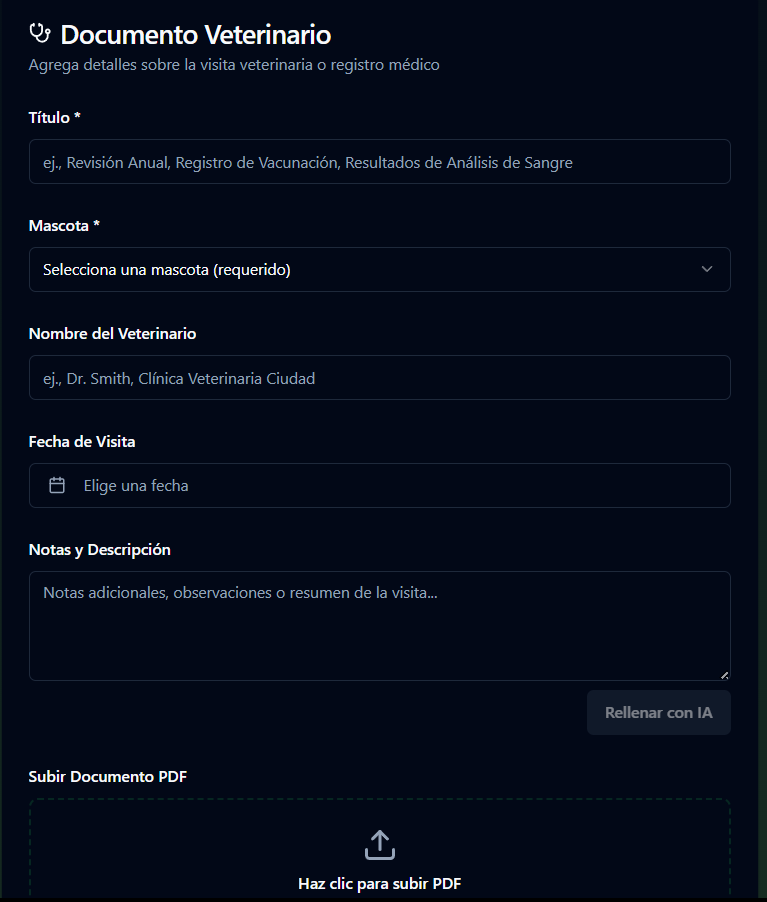
---

## 12. Usar el Asistente Virtual

Abre el asistente desde el Dashboard. Si quieres, elige una mascota para que las respuestas sean más personalizadas. Escribe tu pregunta (por ejemplo, "¿Cuántas veces debo alimentar a mi perro?") y envía. El asistente recuerda la conversación, así que puedes hacer preguntas de seguimiento. Si hay preguntas rápidas disponibles, úsalas. También puedes analizar documentos desde "Notas Veterinarias Recientes".

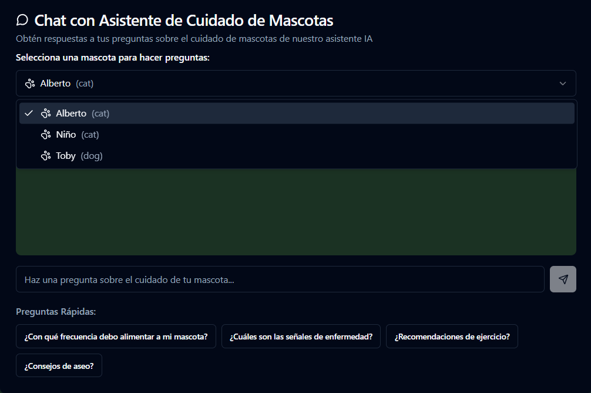
---

## 13. Seguimiento de Peso, Vacunas y Desparasitaciones

Abre "Seguimiento" y elige una mascota. Tienes 4 pestañas:

- **Peso**: Anota el peso, fecha y notas. Verás un gráfico de cómo ha cambiado
- **Vacunas**: Registra qué vacuna, cuándo y observaciones. Puedes crear recordatorios automáticos
- **Desparasitaciones**: Lo mismo que vacunas
- **Línea de Tiempo**: Todo junto en orden cronológico

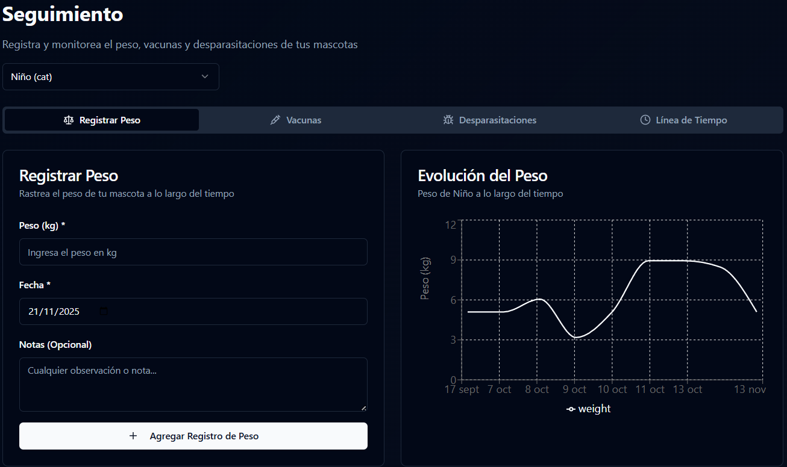
---

## 14. Actualizar Foto de Perfil de Mascota

Haz clic en "Actualizar Foto de Mascota", elige la mascota y sube una nueva foto (JPG, PNG o GIF, máximo 10MB). Puedes arrastrarla o seleccionarla. Guarda cuando esté lista.

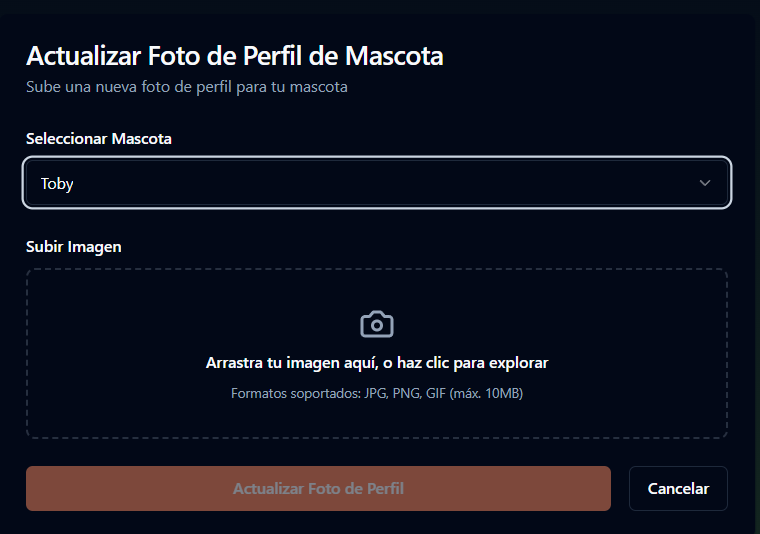
---

## 15. Cambiar Idioma y Tema

Arriba a la derecha verás los selectores. El de idioma cambia entre español e inglés. El de tema (sol/luna) alterna entre claro y oscuro. Los cambios son instantáneos.

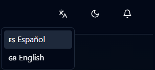
---


# Información Técnica para Desarrolladores

Esta sección está dirigida a desarrolladores que quieren entender, instalar, configurar o contribuir al proyecto.

---

## 17. Arquitectura del Sistema

### Visión General

PetCare es una aplicación web de arquitectura moderna que sigue el patrón de Single Page Application (SPA) con las siguientes características:

- **Frontend**: Aplicación React con TypeScript ejecutándose en el navegador
- **Backend**: Supabase como Backend-as-a-Service (BaaS)
- **Base de Datos**: PostgreSQL gestionada por Supabase
- **Almacenamiento**: Supabase Storage para imágenes y documentos
- **Autenticación**: Supabase Auth con JWT
- **APIs Externas**: Integración con servicios de IA y FHIR

### Flujo de Datos

```
Usuario (Navegador)
    ↓
Frontend React (TypeScript)
    ↓
Supabase Client (SDK)
    ↓
Supabase Backend
    ├──→ PostgreSQL (Base de Datos)
    ├──→ Storage (Archivos)
    └──→ Auth (Autenticación)
    ↓
APIs Externas
    ├──→ API de Predicción de Enfermedades Dermatológicas
    ├──→ Webhooks de IA (Asistente Virtual)
    └──→ HAPI FHIR Server (Recursos médicos)
```

### Componentes Principales

1. **Frontend (React + TypeScript)**
   - Interfaz de usuario interactiva
   - Gestión de estado con React Query
   - Enrutamiento con React Router
   - Componentes UI con shadcn/ui

2. **Backend (Supabase)**
   - Base de datos PostgreSQL
   - Autenticación y autorización
   - Almacenamiento de archivos
   - Edge Functions (opcional)

3. **Servicios Externos**
   - API de análisis de imágenes
   - Webhooks para asistente de IA
   - Servidor FHIR para recursos médicos

---

## 18. Tecnologías Utilizadas

### Frontend

- **React 18.3.1**: Biblioteca de JavaScript para construir interfaces de usuario
  - Hooks modernos (useState, useEffect, useContext)
  - Componentes funcionales
  - Virtual DOM para rendimiento

- **TypeScript 5.8.3**: Superset de JavaScript con tipos estáticos
  - Detección de errores en tiempo de compilación
  - Mejor autocompletado en IDEs
  - Documentación implícita a través de tipos

- **Vite 5.4.19**: Herramienta de construcción y desarrollo
  - Hot Module Replacement (HMR) ultra-rápido
  - Build optimizado para producción
  - Soporte nativo para TypeScript

- **React Router 6.30.1**: Enrutamiento del lado del cliente
  - Navegación sin recargar la página
  - Rutas protegidas
  - Parámetros de URL dinámicos

- **Tailwind CSS 3.4.17**: Framework de CSS utility-first
  - Estilos rápidos sin escribir CSS personalizado
  - Diseño responsive por defecto
  - Sistema de diseño consistente

- **shadcn/ui**: Componentes de UI accesibles
  - Basados en Radix UI
  - Totalmente personalizables
  - Accesibilidad (a11y) integrada

- **React Query 5.83.0**: Manejo de estado del servidor
  - Caché automático de datos
  - Sincronización en segundo plano
  - Gestión de estados de carga y error

### Backend y Servicios

- **Supabase 2.57.4**: Backend-as-a-Service
  - PostgreSQL como base de datos
  - Autenticación con JWT
  - Storage para archivos
  - Row Level Security (RLS) para seguridad

- **HL7 FHIR**: Estándar para intercambio de información médica
  - Recursos Patient y Observation
  - Interoperabilidad con sistemas médicos
  - Estructura de datos estandarizada

- **HAPI FHIR Server**: Servidor FHIR público
  - Almacenamiento de recursos FHIR
  - API REST estándar
  - Validación de recursos

### IA y Análisis

- **API de Predicción de Enfermedades Dermatológicas**: Modelo de IA especializado
  - Análisis de imágenes de piel
  - Soporte para perros y gatos
  - Probabilidades de diagnóstico

- **Webhooks**: Integración con servicios de IA externos
  - Asistente virtual conversacional
  - Análisis de documentos PDF
  - Extracción de información médica

### Herramientas de Desarrollo

- **ESLint 9.32.0**: Linter para JavaScript/TypeScript
  - Detección de errores y problemas
  - Enforcing de mejores prácticas
  - Integración con TypeScript

- **PostCSS 8.5.6**: Procesador de CSS
  - Autoprefixer para compatibilidad
  - Optimización de CSS

- **SWC**: Compilador rápido
  - Compilación de TypeScript/JavaScript
  - Transpilación de JSX
  - Más rápido que Babel

---

## 19. Instalación y Configuración

### Requisitos Previos

- **Node.js 18 o superior**: [Descargar Node.js](https://nodejs.org/)
  - Recomendado usar nvm para gestión de versiones
  - Verificar instalación: `node --version`

- **npm o yarn**: Gestor de paquetes (viene con Node.js)
  - Verificar instalación: `npm --version`

- **Git**: Para clonar el repositorio
  - Verificar instalación: `git --version`

- **Cuenta de Supabase**: Gratuita en [supabase.com](https://supabase.com)

### Pasos de Instalación

#### 1. Clonar el Repositorio

```bash
# Clonar el repositorio
git clone <URL_DEL_REPOSITORIO>

# Navegar al directorio del proyecto
cd vet-vision-ai
```

#### 2. Instalar Dependencias

```bash
# Instalar todas las dependencias del proyecto
npm install

# O si usas yarn
yarn install
```

Este comando instalará todas las dependencias listadas en `package.json`, incluyendo React, TypeScript, Vite, y todas las librerías necesarias.

#### 3. Configurar Variables de Entorno

```bash
# Copiar el archivo de ejemplo
cp env.example .env

# Editar el archivo .env con tus configuraciones
# Usa tu editor de texto preferido
```

Ver sección de [Configuración de Variables de Entorno](#21-configuración-de-variables-de-entorno) para más detalles.

#### 4. Configurar Supabase

Las credenciales de Supabase se configuran en el archivo `.env`. Si aún no las has agregado:

1. Ve al dashboard de tu proyecto en Supabase
2. Ve a Settings > API
3. Copia la "Project URL" y la "anon public" key
4. Agrega estas credenciales a tu archivo `.env` (ver sección de Variables de Entorno)

#### 5. Iniciar el Servidor de Desarrollo

```bash
# Iniciar el servidor de desarrollo
npm run dev

# El servidor estará disponible en:
# http://localhost:8080
```

El servidor de desarrollo incluye:
- Hot Module Replacement (HMR): Los cambios se reflejan instantáneamente
- Source maps: Para debugging fácil
- Error overlay: Muestra errores directamente en el navegador

### Scripts Disponibles

```bash
# Desarrollo
npm run dev              # Inicia servidor de desarrollo en puerto 8080

# Producción
npm run build            # Construye la aplicación para producción
npm run build:dev        # Construye en modo desarrollo
npm run preview          # Previsualiza la build de producción localmente

# Calidad de Código
npm run lint             # Ejecuta ESLint para verificar código
```

---

## 20. Estructura del Proyecto

```
vet-vision-ai/
├── src/                          # Código fuente principal
│   ├── components/               # Componentes React reutilizables
│   │   ├── ui/                   # Componentes de UI (shadcn/ui)
│   │   │   ├── accordion.tsx
│   │   │   ├── alert-dialog.tsx
│   │   │   ├── alert.tsx
│   │   │   ├── avatar.tsx
│   │   │   ├── badge.tsx
│   │   │   ├── button.tsx
│   │   │   ├── calendar.tsx
│   │   │   ├── card.tsx
│   │   │   ├── chart.tsx
│   │   │   ├── checkbox.tsx
│   │   │   ├── dialog.tsx
│   │   │   ├── dropdown-menu.tsx
│   │   │   ├── form.tsx
│   │   │   ├── input.tsx
│   │   │   ├── label.tsx
│   │   │   ├── select.tsx
│   │   │   ├── separator.tsx
│   │   │   ├── tabs.tsx
│   │   │   ├── textarea.tsx
│   │   │   ├── toast.tsx
│   │   │   └── ...               # Más componentes UI de shadcn
│   │   ├── tracking/             # Componentes de seguimiento
│   │   │   ├── WeightTab.tsx     # Pestaña de peso
│   │   │   ├── VaccineTab.tsx    # Pestaña de vacunas
│   │   │   ├── DewormingTab.tsx  # Pestaña de desparasitaciones
│   │   │   └── TimelineTab.tsx   # Pestaña de línea de tiempo
│   │   ├── ThemeProvider.tsx     # Proveedor de tema (claro/oscuro)
│   │   ├── LanguageProvider.tsx  # Proveedor de idioma (español/inglés)
│   │   ├── LanguageToggle.tsx    # Botón para cambiar idioma
│   │   ├── ThemeToggle.tsx       # Botón para cambiar tema
│   │   └── MarkdownMessage.tsx   # Componente para renderizar markdown
│   │
│   ├── pages/                    # Páginas de la aplicación
│   │   ├── Landing.tsx           # Página de inicio/presentación
│   │   ├── Login.tsx             # Página de inicio de sesión
│   │   ├── Register.tsx          # Página de registro
│   │   ├── Dashboard.tsx         # Panel principal
│   │   ├── AddPet.tsx            # Agregar nueva mascota
│   │   ├── EditPet.tsx           # Editar mascota existente
│   │   ├── AnalyzePetHealth.tsx  # Análisis de salud con IA
│   │   ├── CreateReminder.tsx    # Crear recordatorio
│   │   ├── Calendar.tsx          # Vista de calendario
│   │   ├── AskAssistant.tsx      # Chat con asistente de IA
│   │   ├── UploadVetNote.tsx     # Subir documentos veterinarios
│   │   ├── UploadImage.tsx       # Actualizar foto de mascota
│   │   ├── Tracking.tsx          # Seguimiento (peso, vacunas, etc.)
│   │   ├── ForgotPassword.tsx    # Recuperar contraseña
│   │   └── NotFound.tsx          # Página 404
│   │
│   ├── services/                 # Servicios y APIs
│   │   ├── assistantService.ts   # Servicio del asistente de IA
│   │   ├── fhirApiService.ts     # Servicio para recursos FHIR
│   │   ├── imageUploadService.ts # Servicio de subida de imágenes
│   │   └── skinDiseasePredictionService.ts # API de predicción de enfermedades
│   │
│   ├── hooks/                    # Hooks personalizados de React
│   │   ├── useAuth.tsx           # Hook de autenticación
│   │   ├── useTranslation.ts     # Hook de traducciones
│   │   ├── use-mobile.tsx        # Detectar dispositivos móviles
│   │   └── use-toast.ts          # Hook para notificaciones toast
│   │
│   ├── integrations/             # Integraciones externas
│   │   └── supabase/
│   │       ├── client.ts         # Cliente de Supabase configurado
│   │       └── types.ts          # Tipos TypeScript de la base de datos
│   │
│   ├── lib/                      # Utilidades y librerías
│   │   ├── utils.ts              # Funciones utilitarias (cn, etc.)
│   │   └── translations.ts       # Archivo de traducciones (español/inglés)
│   │
│   ├── assets/                   # Recursos estáticos
│   │   ├── ai-analysis-icon.jpg  # Ícono de análisis de IA
│   │   ├── calendar-icon.jpg     # Ícono de calendario
│   │   ├── hero-pets.jpg         # Imagen hero de la landing
│   │   └── medical-icon.jpg      # Ícono médico
│   │
│   ├── App.tsx                   # Componente principal de la aplicación
│   ├── main.tsx                  # Punto de entrada de la aplicación
│   ├── index.css                 # Estilos globales
│   └── vite-env.d.ts             # Tipos de Vite
│
├── public/                       # Archivos públicos estáticos
│   ├── favicon.ico               # Ícono de la aplicación
│   └── robots.txt                # Configuración para buscadores
│
├── .gitignore                    # Archivos ignorados por Git
├── index.html                    # HTML principal
├── package.json                  # Dependencias y scripts
├── env.example                   # Ejemplo de variables de entorno
└── README.md                     # Este archivo
```

**Nota**: La carpeta `dist/` se genera automáticamente al ejecutar `npm run build` y contiene los archivos compilados para producción.

### Explicación de Carpetas Principales

- **src/components/**: Componentes React reutilizables que se usan en múltiples páginas
  - `ui/`: Componentes de shadcn/ui (botones, formularios, diálogos, etc.)
  - `tracking/`: Componentes específicos para el seguimiento de salud
- **src/pages/**: Componentes de página que representan rutas completas de la aplicación
- **src/services/**: Lógica de negocio y comunicación con APIs externas
- **src/hooks/**: Hooks personalizados que encapsulan lógica reutilizable
- **src/integrations/**: Configuración de servicios externos (Supabase)
- **src/lib/**: Utilidades generales y configuraciones compartidas
- **public/**: Archivos estáticos servidos directamente (favicon, robots.txt, etc.)

---

## 21. Configuración de Variables de Entorno

### Archivo .env

Crea un archivo `.env` en la raíz del proyecto basándote en `env.example`. Este archivo contiene configuraciones sensibles y no debe versionarse en Git.

### Variables Requeridas

```env
# Supabase Configuration
# Obtén estas credenciales desde tu proyecto en Supabase: Settings > API
VITE_SUPABASE_URL=https://your-project-id.supabase.co
VITE_SUPABASE_ANON_KEY=your_supabase_anon_key_here

# API de Predicción de Enfermedades Dermatológicas
# URL del servicio de IA para análisis de imágenes de piel
VITE_SKIN_DISEASE_API_URL=https://tu-api-url.com
```

**Nota**: Las variables de Supabase son obligatorias para que la aplicación funcione. La API de predicción es requerida para el análisis de salud con IA.

### Variables Opcionales

```env
# Webhooks para el Asistente de IA
# URL del webhook para preguntas generales al asistente
VITE_WEBHOOK_URL=http://localhost:3001/webhook/assistant

# URL del webhook para análisis de documentos PDF
VITE_PDF_WEBHOOK_URL=http://localhost:3001/webhook/pdf-analysis

# URL del webhook para extracción de prescripciones médicas
VITE_PDF_PRESCRIPTION_WEBHOOK_URL=http://localhost:3001/webhook/pdf-prescription

# URL del webhook para operaciones generales
VITE_GENERAL_WEBHOOK_URL=http://localhost:3001/webhook/general

# API Key para autenticación con los webhooks (opcional)
VITE_WEBHOOK_API_KEY=tu_api_key_aqui

# Servidor FHIR
# URL del servidor HAPI FHIR (por defecto usa el servidor público)
VITE_FHIR_SERVER_BASE_URL=https://hapi.fhir.org/baseR4
```

### Configuración de Supabase

Las credenciales de Supabase se configuran mediante variables de entorno. Para obtenerlas:

1. Ve al dashboard de Supabase: https://supabase.com/dashboard
2. Selecciona tu proyecto
3. Ve a Settings > API
4. Copia la "Project URL" y la "anon public" key
5. Agrega estas credenciales a tu archivo `.env`:

```env
VITE_SUPABASE_URL=https://tu-proyecto-id.supabase.co
VITE_SUPABASE_ANON_KEY=tu_clave_anon_aqui
```

El cliente de Supabase en `src/integrations/supabase/client.ts` leerá automáticamente estas variables de entorno.

### Variables de Entorno en Vite

Todas las variables de entorno en Vite deben comenzar con `VITE_` para ser accesibles en el código del frontend. Esto es por seguridad: solo las variables con este prefijo se exponen al cliente.

**Ejemplo de uso en código**:

```typescript
const apiUrl = import.meta.env.VITE_SKIN_DISEASE_API_URL;
```

---

## 22. Servicios y APIs

### assistantService.ts

Servicio para interactuar con el asistente de IA mediante webhooks.

**Funciones principales**:

- `askQuestion(request)`: Envía una pregunta al asistente
- `analyzePdf(pdfUrl, title, petName, userId)`: Analiza un documento PDF
- `analyzePdfFile(file, title, petName, userId)`: Analiza un PDF desde archivo
- `analyzePdfPrescription(pdfUrl, ...)`: Extrae prescripciones médicas de PDFs

**Configuración**: Usa variables de entorno `VITE_WEBHOOK_URL`, `VITE_PDF_WEBHOOK_URL`, etc.

### fhirApiService.ts

Servicio para crear y gestionar recursos HL7 FHIR.

**Funciones principales**:

- `createPetInFhir(petData)`: Crea un recurso Patient y Observation en HAPI FHIR
- `createWeightObservation(patientId, weight, date)`: Crea una Observation de peso

**Servidor FHIR**: Por defecto usa `https://hapi.fhir.org/baseR4` (servidor público)

**Recursos creados**:
- **Patient**: Información de la mascota con extensiones personalizadas (especie, raza)
- **Observation**: Observaciones médicas (peso) vinculadas al Patient

### imageUploadService.ts

Servicio para subir imágenes a almacenamiento en la nube.

**Funciones principales**:

- `uploadPetImage(file, userId, petId)`: Sube una imagen (soporta Supabase y Azure)

**Proveedores soportados**:
- **Supabase Storage**: Configurado por defecto (bucket: 'pet-images')
- **Azure Blob Storage**: Opcional, requiere configuración adicional

**Estructura de archivos**: `{userId}/{timestamp}.{extension}`

### skinDiseasePredictionService.ts

Servicio para la API de predicción de enfermedades dermatológicas.

**Funciones principales**:

- `predictSkinDisease(file, animalType)`: Predice enfermedades de piel desde una imagen
- `checkHealth()`: Verifica el estado de la API
- `getAvailableClasses()`: Obtiene lista de enfermedades disponibles
- `getApiInfo()`: Obtiene información general de la API

**Tipos de animales soportados**: 'perros' o 'gatos'

**Formatos de imagen**: JPG, PNG, BMP, TIFF

**Respuesta**: Incluye enfermedad detectada, nivel de confianza, probabilidades de todas las enfermedades, y recomendaciones.

---

## 23. Base de Datos y Backend

### Supabase como Backend

PetCare usa Supabase como Backend-as-a-Service, lo que proporciona:

- **Base de datos PostgreSQL**: Base de datos relacional completa
- **Autenticación**: Sistema de autenticación con JWT
- **Storage**: Almacenamiento de archivos (imágenes, PDFs)
- **Row Level Security (RLS)**: Seguridad a nivel de fila
- **Edge Functions**: Funciones serverless (opcional)

### Estructura de la Base de Datos

Las tablas principales incluyen:

- **pets**: Información de las mascotas
  - id, user_id, name, species, breed, birth_date, weight, etc.
  - fhir_patient_id: ID del recurso Patient en HAPI FHIR

- **reminders**: Recordatorios de eventos
  - id, user_id, pet_id, title, description, date, time, type, completed

- **ai_analyses**: Resultados de análisis de IA
  - id, user_id, pet_id, image_url, analysis_result, confidence, recommendations

- **vet_notes**: Documentos veterinarios
  - id, user_id, pet_id, title, veterinarian, visit_date, description, file_url

- **weight_records**: Registros de peso
  - id, pet_id, weight, date, notes

- **vaccines**: Registro de vacunas
  - id, pet_id, vaccine_type, date, observations, reminder_frequency_years

- **dewormings**: Registro de desparasitaciones
  - id, pet_id, deworming_type, date, observations, reminder_frequency_months

### Autenticación

- **Método**: Supabase Auth con JWT (JSON Web Tokens)
- **Almacenamiento de sesión**: localStorage del navegador
- **Renovación automática**: Los tokens se renuevan automáticamente
- **Row Level Security**: Cada usuario solo puede acceder a sus propios datos

### Migraciones

Las migraciones de base de datos están en `supabase/migrations/`. Estas migraciones:

- Crean las tablas necesarias
- Definen relaciones entre tablas (foreign keys)
- Configuran índices para rendimiento
- Establecen políticas de seguridad (RLS)

---

## 24. Despliegue

### Despliegue en Lovable

La forma más fácil de desplegar es usando Lovable:

1. Abre [Lovable](https://lovable.dev/projects/88405ff8-0337-4e06-a9c1-a469ccb39f59)
2. Haz clic en **Share → Publish**
3. Sigue las instrucciones en pantalla
4. La aplicación se desplegará automáticamente

### Despliegue Manual

#### Opción 1: Vercel

```bash
# Instalar Vercel CLI
npm i -g vercel

# Construir la aplicación
npm run build

# Desplegar
vercel deploy

# O desplegar a producción
vercel --prod
```

**Configuración en Vercel**:
- Framework Preset: Vite
- Build Command: `npm run build`
- Output Directory: `dist`
- Install Command: `npm install`

#### Opción 2: Netlify

```bash
# Instalar Netlify CLI
npm i -g netlify-cli

# Construir la aplicación
npm run build

# Desplegar
netlify deploy --prod --dir=dist
```

**Configuración en Netlify**:
- Build command: `npm run build`
- Publish directory: `dist`

#### Opción 3: Otras Plataformas

Para cualquier plataforma que soporte hosting estático:

1. Ejecuta `npm run build`
2. Sube la carpeta `dist` a tu servidor
3. Configura tu servidor para servir archivos estáticos
4. Asegúrate de que todas las rutas redirijan a `index.html` (SPA routing)

### Variables de Entorno en Producción

Asegúrate de configurar las variables de entorno en tu plataforma de despliegue:

- En Vercel: Project Settings → Environment Variables
- En Netlify: Site Settings → Build & Deploy → Environment
- En otras plataformas: Consulta la documentación de tu proveedor

### Dominio Personalizado

Para conectar un dominio personalizado:

1. En Lovable: **Project → Settings → Domains → Connect Domain**
2. Sigue las instrucciones para configurar DNS
3. Espera la propagación DNS (puede tardar hasta 48 horas)

---

## 25. Contribuir al Proyecto

### Estándares de Código

- **TypeScript**: Todo el código nuevo debe estar en TypeScript
- **Convenciones de nomenclatura**:
  - Componentes: PascalCase (ej: `MyComponent.tsx`)
  - Funciones y variables: camelCase (ej: `myFunction`)
  - Constantes: UPPER_SNAKE_CASE (ej: `API_BASE_URL`)
- **Comentarios**: Agrega comentarios JSDoc a funciones públicas
- **Linting**: Ejecuta `npm run lint` antes de hacer commit

### Proceso de Contribución

1. **Fork el proyecto**
   ```bash
   # Fork en GitHub, luego clona tu fork
   git clone https://github.com/TU_USUARIO/vet-vision-ai.git
   ```

2. **Crea una rama para tu feature**
   ```bash
   git checkout -b feature/mi-nueva-funcionalidad
   ```

3. **Haz tus cambios**
   - Escribe código limpio y bien documentado
   - Agrega tests si es necesario
   - Actualiza la documentación

4. **Commit tus cambios**
   ```bash
   git add .
   git commit -m "Agregar: descripción de los cambios"
   ```

5. **Push a tu rama**
   ```bash
   git push origin feature/mi-nueva-funcionalidad
   ```

6. **Abre un Pull Request**
   - Ve al repositorio original en GitHub
   - Haz clic en "New Pull Request"
   - Describe tus cambios claramente

### Guía de Estilo

- **Indentación**: 2 espacios
- **Comillas**: Comillas simples para strings
- **Punto y coma**: Opcional (consistente con el proyecto)
- **Imports**: Ordenados y agrupados (React primero, luego librerías, luego código local)

### Agregar una Nueva Funcionalidad

1. **Crear el componente/página**
   ```typescript
   // src/pages/NuevaFuncionalidad.tsx
   import { useState } from 'react';
   
   export default function NuevaFuncionalidad() {
     // Tu código aquí
   }
   ```

2. **Agregar la ruta en App.tsx**
   ```typescript
   import NuevaFuncionalidad from "./pages/NuevaFuncionalidad";
   
   // En el componente App, dentro de <Routes>
   <Route path="/nueva-funcionalidad" element={<NuevaFuncionalidad />} />
   ```

3. **Agregar traducciones**
   ```typescript
   // src/lib/translations.ts
   nuevaFuncionalidad: {
     title: "Nueva Funcionalidad",
     description: "Descripción de la funcionalidad",
     // ...
   }
   ```

4. **Agregar enlace en el Dashboard** (si aplica)
   ```typescript
   <Link to="/nueva-funcionalidad">
     <Button>Nueva Funcionalidad</Button>
   </Link>
   ```

### Trabajar con Supabase

**Consultar datos**:
```typescript
import { supabase } from '@/integrations/supabase/client';

const { data, error } = await supabase
  .from('pets')
  .select('*')
  .eq('user_id', userId);
```

**Insertar datos**:
```typescript
const { data, error } = await supabase
  .from('pets')
  .insert({
    name: 'Firulais',
    species: 'Perro',
    user_id: userId
  });
```

**Actualizar datos**:
```typescript
const { error } = await supabase
  .from('pets')
  .update({ weight: 15.5 })
  .eq('id', petId);
```

**Eliminar datos**:
```typescript
const { error } = await supabase
  .from('pets')
  .delete()
  .eq('id', petId);
```